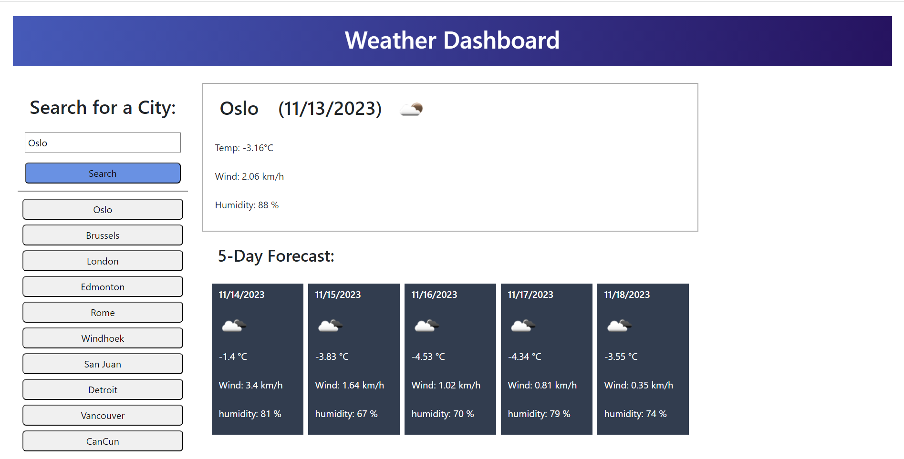

# weather-man

## Description

The intent of this project is to have a weather app to check the climate of various cities.

The user can search common cities which presents the current and five day forecast.

I learned from this project to remember to clear local storage as it may crash the app on a fresh start-up after coding was thought to be done.

I was more pragmatic on this challenge regarding dynamic content.  Much was just designed at the outset to be static in HTML and that worked out fine.

Please note that I deliberately capped the history to fifteen entries.
## Installation   

Application - <a href="https://harrymac1972.github.io/weather-man/" style="font-weight:bolder;">Weather Man</a>
Repository Location - <code><strong>https://github.com/harrymac1972/weather-man</strong></code>
Git Bash - <code><strong>git clone git@github.com:harrymac1972/weather-man.git</strong></code> once in your folder of choice

## Usage

## Credits

Resources:

    https://www.w3schools.com/jquery/default.asp

    